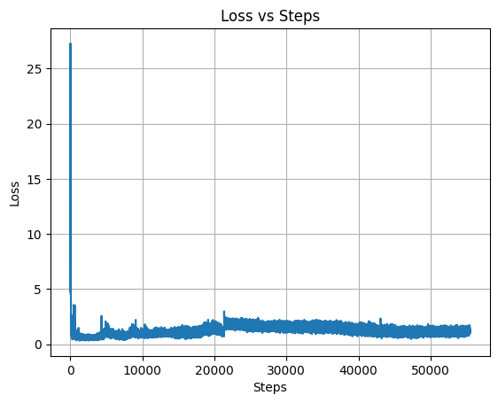
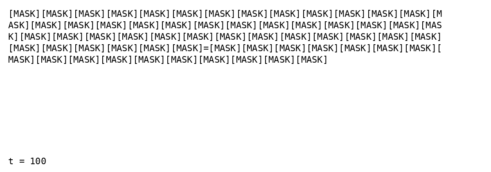

# AtomWell Reimplementation

A reimplementation of Bindwell's AtomWell architecture - a D3PM diffusion model for molecular sequences (SMILES), proteins, and DNA, inspired by their [blog post](https://bindwell.ai/posts/defeating-pests-with-ai).

**Important Note:** This is an independent reimplementation based on limited public information. The actual Bindwell implementation likely differs significantly in architecture choices, training procedures, and optimizations. This represents my interpretation of their approach.

## Data & Checkpoints

Download preprocessed data and model checkpoint: [Google Drive](https://drive.google.com/drive/folders/1fgqQTog9zG66mKLjBLvbUveA0zfLPr5r?usp=sharing)

## Overview

**Architecture:** 12-layer transformer (1024-dim, 16 attention heads, ~150M parameters) with Flash Attention 3 and RoPE positional embeddings

**Training data:** ~100M sequences from:
- 50M SMILES (small molecules)
- 40M proteins (UniRef50)
- 10M RNA sequences (SILVA rRNA database)

**Training progress:** ~60k steps (~4B-5B tokens) with gradient accumulation and mixed precision

**Training throughput:** 20-30k tokens/sec on Lightning.ai H200 GPUs (measured as non-padding tokens processed per second through forward + backward + optimizer step)

**Note on training:** I made an architecture change mid-training (added layer norm). Ideally this would require restarting, but given limited resources, I continued from the checkpoint. The model still converges and generates reasonable sequences, though performance could be better with a clean run.

## Model Architecture

### ESMDiffusion Model (`model.py`)

**Core components:**

1. **Token Embeddings** - Standard embedding layer (vocab_size → 1024)
2. **Positional Embeddings** - Learned embeddings up to max_seq_len=2048
3. **Domain Embeddings** - 3 domains (SMILES=0, protein=1, RNA=2) allowing model to condition on sequence type
4. **Timestep MLP** - Sinusoidal encoding → 2-layer MLP for diffusion time conditioning
5. **Transformer Layers** (12 layers):
   - Multi-head self-attention (16 heads) with RoPE
   - FFN with 4x expansion (1024 → 4096 → 1024)
   - Pre-norm architecture (layer norm before attention/FFN)
   - Gradient checkpointing for memory efficiency
6. **LM Head** - Projects to vocabulary logits with weight tying

**Forward pass:**
```
Input: x_t (noisy tokens), t (timestep), domain
↓
Token Embedding + Positional Embedding + Domain Embedding + Timestep Conditioning
↓
12 Transformer Layers (with gradient checkpointing)
↓
Layer Norm
↓
LM Head → Logits (predicting clean x0)
```

**Key feature:** Token dropout - zeros out `[MASK]` token embeddings during training to force prediction from context only.

### Diffusion Framework: D3PM

**Discrete Denoising Diffusion (`diffusion.py`):**
- T=100 timesteps
- Noise schedule: Linear beta from 1e-4 to 0.02
- Transition: Each token has probability α̅_t of staying clean, (1-α̅_t) of becoming `[MASK]`

**Training objective:**
```python
# 1. Sample random timestep
t = diffusion.sample_timesteps(B, device)  # Random t ∈ [1, 100]

# 2. Forward diffusion: x0 → x_t (add noise)
x_t = diffusion.q_sample(x0, t)  # Stochastically mask tokens

# 3. Model predicts original x0 from noisy x_t
logits = model(x_t, t, domain, positions, boundaries)

# 4. Loss: Cross-entropy against original tokens
loss = F.cross_entropy(logits.view(-1, vocab_size), x0.view(-1))
```

**Key insight:** Model learns to denoise by predicting x0 directly (not the noise itself), using standard cross-entropy loss. Non-autoregressive - learns to denoise at all noise levels simultaneously.

## Key Implementation Details

### Sequence Packing

One of the core efficiency optimizations is **sequence packing** - concatenating multiple sequences into fixed 2048-token chunks to maximize GPU utilization.

**How it works (`dataset.py`):**
1. Each sequence gets `[EOS]` appended, sequences separated by `[SEP]`
2. Three parallel arrays track packed data:
   - `current_tok`: Token IDs
   - `current_dom`: Domain ID (0=SMILES, 1=protein, 2=RNA)
   - `current_pos`: Position within each sequence (resets to 0 for each new sequence)

**Example packed sequence:**
```
Tokens:    [seq1_t1, seq1_t2, [EOS], [SEP], seq2_t1, seq2_t2, seq2_t3, [EOS], ...]
Positions: [0,       1,       2,     0,     0,       1,       2,       3,     ...]
Boundaries:[0,                       4,                              8,     ...]
```

### Flash Attention with Variable Length Sequences

The packed sequences require careful handling in attention to maintain semantic separation between individual sequences.

**Implementation (`multihead_attention.py`):**

1. **Boundary detection:** Position resets (0 after non-0) mark new sequence starts
2. **Extract sub-sequences:** Use boundaries to split packed batch into individual sequences
3. **Flatten for FlashAttention:**
```python
q_varlen = torch.cat(all_seqs_q, dim=0)  # (total_tokens, H, D)
cu_seqlens_tensor = torch.tensor(cu_seqlens_flat, dtype=torch.int32)
```
4. **Call `flash_attn_varlen_func`:** The `cu_seqlens` parameter tells FlashAttention where each sequence starts/ends, so attention is computed **only within** each sub-sequence, not across them
5. **Reconstruct output:** Scatter results back to original (B, T, H, D) positions

**Key insight:** This maintains semantic separation between packed sequences while achieving maximum GPU efficiency - sequences don't attend to each other despite being in the same batch.

### Rotary Position Embeddings

RoPE is applied using the per-sequence position indices from packing (`rotary_embedding.py`). This ensures position 0 restarts for each new sequence, maintaining correct positional information even in packed batches.

### What Makes This Implementation Unique

1. **Multi-domain training:** Single model handles SMILES, proteins, and RNA via domain embeddings
2. **Packed sequences:** Efficient batching with boundary tracking for proper attention masking
3. **FlashAttention varlen:** Optimized for variable-length packed sequences without cross-contamination
4. **D3PM diffusion:** Non-autoregressive denoising objective - learns to recover clean sequences from any noise level

## Training Configuration

- **Parameters:** ~+150M
- **Batch size:** 16 sequences/batch × 16 gradient accumulation = 256 effective batch
- **Optimizer:** AdamW (lr=1e-5, β=(0.9, 0.95), weight_decay=0.1)
- **Precision:** BF16 mixed precision with gradient scaling
- **Gradient clipping:** Max norm 5.0
- **Memory optimization:** Gradient checkpointing disabled
- **Sequence length:** 2048 tokens (packed)
- **Diffusion steps:** T=100
- **Attention:** Bidirectional (non-causal) FlashAttention 2

## Compute Setup

This was trained entirely using free Lightning.ai credits across ~30 accounts over **8 days of continuous training**. Since each free account provided 4 hours of GPU time, I manually rotated accounts every 4 hours to maintain training continuity.

All data and checkpoints were stored on Google Drive with rclone for fast transfers. Each instance setup took ~6 minutes to download 60GB and resume training from the latest checkpoint. This setup allowed me to complete 60k training steps (8B tokens) with zero compute budget.

**Training workflow:**
1. Train for ~4 hours on Lightning.ai free credits
2. Checkpoint automatically uploads to Google Drive via rclone
3. Spin up new account, run `setup_instance.py` (~6 min)
4. Resume training from latest checkpoint
5. Repeat for 8 days

The throughput measurement here refers to how many actual (non-padding) tokens the model processes per second during training, including the forward pass, backward pass, and optimizer update. This is the standard metric for comparing training efficiency across different hardware and batch configurations.


### Data Preparation

If preprocessing from scratch:
```bash
python preprocess.py
```

This tokenizes and packs sequences into 2048-token chunks with mixed-domain batching.

## File Structure

- **module.py** - Transformer layers, layer norms, positional embeddings
- **multihead_attention.py** - Multi-head attention with FlashAttention 2 varlen support and RoPE
- **rotary_embedding.py** - Rotary positional encoding implementation
- **diffusion.py** - D3PM discrete diffusion process (forward q_sample, reverse p_sample)
- **model.py** - ESMDiffusion model architecture with domain conditioning
- **dataset.py** - Streaming packed dataset with boundary tracking for FlashAttention
- **train.py** - Training loop with gradient accumulation, mixed precision, checkpointing
- **sample.py** - Reverse diffusion sampling for sequence generation
- **upload.py** - Auto-upload checkpoints to Google Drive via rclone
- **setup_instance.py** - Quick setup script for new training instances

## Quick Start

### Training

```bash
python train.py
```

Checkpoints saved every 50 steps to `checkpoints/`.

### Sampling

Generate new sequences:
```bash
python sample.py
```

### Setting Up New Instance

For continuing training on a fresh machine:
```bash
python setup_instance.py
```

Installs dependencies (including FlashAttention 2), downloads data chunks and latest checkpoint from Drive.

## Automatic Checkpoint Backup

Continuously monitor and upload checkpoints to Google Drive:
```bash
python upload.py
```

Uploads latest checkpoints and removes older ones from remote storage.

## Results

### Training Loss



*Loss converges*

### Diffusion Process Visualization



*Reverse diffusion sampling from t=100 (fully masked) to t=0 (generated sequence). Shows the model progressively denoising tokens to generate coherent sequences.*

### Sample Generations

Generated sequences after 60k steps (4B-5B tokens). Note: Model is undertrained - SMILES show structural issues while proteins are more coherent. With full 50B+ token training, all domains would improve significantly.

**Example SMILES output:**
```
[sample 0] #))CCCCOC3[=C2C3=CC=(()=CO#B1C(([=C1=[=CC(#1C)OB(=NC)F3H=F[]=C
[sample 1] CC=OC=N1HNN==C)OCH==C=(CC(HF@@[(1CO(CC(O==O3CN38@Hi1=CO@314](C=C
[sample 2] =CCC2=C(CCC@)]OCCC)CCCN@l2(=C1N(C=C=5C(OCNNCC1([HlC2@
[sample 3] CO1NC)CC((N(1H(CN2(OCO==C=N(C(2O))OCOCCC
```
*Invalid syntax due to limited training. Shows model is learning molecular patterns but needs more data.*

**Example protein sequence:**
```
[sample 0] QNMMWLPKLFMQVRYGTFQIGFSNRSFPMDWEFNSNLSRNGLTNTVVSVRSNIDHSTPQLVVGT
[sample 1] QILWLDGRNPNCVSRGLSLQGPSRALEQAAGNLDEPALSIVASTSIDGQTVRDTHVTATTIIV
[sample 2] PQIRGQGDRQTVAIGGMMPAILYRAIHFVALPGGMTGWGSGSWTMKVDSMGASVQSPQFNDCQ
[sample 3] SGVPAGCLKMMGGLLDNTGFLFGAVAMLVILVGFHYGALDPYYMCVVTLSWVMVGPVVVGPLVG
```
*Valid amino acid sequences with reasonable length and composition. Most coherent output domain.*

**Example RNA sequence:**
```
[sample 0] ACAAUCACCCUCAGGACAACAAGCCAAGACAGGAAUUCUCCUCAAAUUAGUAUGAUCCAACUUU
[sample 1] UCAAGUCAAAAUUAAAUAUUAAUAAACGAAAACAAAUUCACAAAUUCUACGGGAUACACCUCGU
[sample 2] CUAUUCAAAACAAAUAAUCCAAUUACACUUCAAGCGCUAAAU
[sample 3] GCGCGUCAAAUACCUAACCUCCACCCAAAAAAUGACGAAACUACACCCCGAUCAAAAGCCCAGU
```
*RNA sequences from SILVA rRNA database (hence U instead of T). Structurally valid but undertrained.*

## Limitations & Future Work

- Training interrupted at 4B-5B tokens (target was 50B+)
- Architecture change mid-training affects convergence
- SMILES generation shows syntactic errors - needs grammar constraints or validity filtering
- Implementation likely differs from actual Bindwell Atomwell in:
  - Model architecture details (layer configs, attention mechanisms)
  - Training procedures and hyperparameters
  - Data preprocessing and filtering strategies
  - Sampling/inference optimizations
- Would benefit from:
  - Full training run from scratch with consistent architecture
  - Scaling to larger model (500M-1B+ params)
  - Better uncertainty quantification
  - Evaluation on binding affinity prediction tasks
  - Proper validation metrics (perplexity, diversity scores, validity rates)
  - Domain-specific decoding strategies
  - Constrained sampling for valid SMILES generation

## Acknowledgments

Architecture and approach based on Bindwell's [Atomwell blog post](https://bindwell.ai/posts/defeating-pests-with-ai). This is an independent reimplementation for research and learning purposes based on limited public information. The actual Bindwell implementation is proprietary and likely differs significantly.

## License

MIT License
